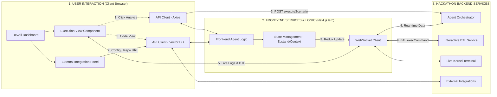

# DevAll - Advanced Multi-Agent DevOps Orchestrator

**DevAll** is a next-generation, high-fidelity command center designed for the orchestration, monitoring, and auditing of AI-driven DevOps agents. Built to integrate seamlessly into the **Microsoft enterprise ecosystem**, it leverages a sophisticated glassmorphism design language and a robust TypeScript-based data model to provide real-time observability across complex pipelines.

---

## System Architecture & Front-End Workflow

The DevAll architecture follows a highly decoupled, real-time workflow separated into three core pillars: Client Interaction, Front-End Logic, and Backend Services. The following diagram illustrates the precise telemetry and execution flow:



### Architecture Highlights:
* **Real-Time Telemetry:** Utilizing a dedicated **WebSocket Client**, the frontend streams live kernel outputs and step-traces directly to the Execution View with zero latency.
* **State Management:** Complex agent states, execution logs, and Git repository info are handled via robust React Context/Zustand implementations.
* **Vector DB Integration:** The frontend API clients interface directly with Vector DBs for semantic code search and context retrieval based on GitHub URL inputs.

---

##  Key Intelligence Modules

### 1. Unified Agent Inspector
A high-fidelity auditing interface that allows developers to "look under the hood" of agent decisions.
* **Execution View Component:** Interactive panel featuring 'Run Scenario', 'Step Trace', and 'Live Kernel' modules.
* **Diff-Highlighter:** Real-time comparison of original code vs. agent-optimized patches using custom syntax highlighting.
* **Contextual Data Tables:** Flat-file representation of complex JSON outputs for quick manual auditing.

### 2. Specialized Agent Personas
Each agent is strictly typed and integrated into the `Front-end Agent Logic` (e.g., CodeFixAgent, RootCauseAgent):
* **David (Repair Specialist)**: Implements automated try/catch injection, failure recovery protocols, and corrected orchestration for staged pipeline execution.
* **Rauli (Creation Architect)**: Specializes in Azure-style resource allocation, automated provisioning, and pipeline scaling.
* **Carlos (Monitoring Expert)**: Provides real-time traffic analysis, security audits, and quarantine logic for malicious IPs.

### 3. Real-Time BI & Observability
Utilizing **Recharts**, DevAll provides granular tracking of:
* **Throughput (amt)**: Agent processing volume.
* **Reliability (pv)**: Success-to-failure ratios per sprint.
* **Latency (uv)**: Execution time in milliseconds across different Azure regions.

---

## Design System & Aesthetics

Our UI follows a **Glassmorphism Design System** tailored for the Microsoft ecosystem:
* **Visual Tokens**: Curated HSL color palette based on Microsoft's brand colors (Red `#f25022`, Blue `#00a4ef`, Green `#7fbb00`, Yellow `#ffb900`).
* **Premium Material**: 20px blur backdrops, subtle border gradients, and 0.05 opacity white overlays for a high-end enterprise feel.
* **Responsive Grid**: Optimized for professional displays (1366x681 and higher) with a component-based layout.

---

##  Technical Stack & Integration

* **Core**: Next.js + TypeScript (for strict model safety).
* **State & Data**: Zustand, Axios/Fetch Wrappers, WebSockets.
* **Styles**: Tailwind CSS + Custom PostCSS Utilities.
* **Icons**: Lucide-React (Vector-based icons).
* **Backend Interface**: Built-in support for Java Spring Boot, Spring AI, and Interactive BTL Services.

---

## Getting Started

This is a [Next.js](https://nextjs.org) project bootstrapped with [`create-next-app`](https://nextjs.org/docs/app/api-reference/cli/create-next-app).

First, run the development server:

```bash
npm run dev
# or
yarn dev
# or
pnpm dev
# or
bun dev
```

Open [http://localhost:3000](http://localhost:3000) with your browser to see the result.

You can start editing the page by modifying `app/page.tsx`. The page auto-updates as you edit the file.

This project uses [`next/font`](https://nextjs.org/docs/app/building-your-application/optimizing/fonts) to automatically optimize and load [Geist](https://vercel.com/font), a new font family for Vercel.

---

## Learn More

To learn more about Next.js, take a look at the following resources:

* [Next.js Documentation](https://nextjs.org/docs) - learn about Next.js features and API.
* [Learn Next.js](https://nextjs.org/learn) - an interactive Next.js tutorial.

You can check out [the Next.js GitHub repository](https://github.com/vercel/next.js) - your feedback and contributions are welcome!

---

## ☁️ Deploy on Vercel

The easiest way to deploy your Next.js app is to use the [Vercel Platform](https://vercel.com/new?utm_medium=default-template&filter=next.js&utm_source=create-next-app&utm_campaign=create-next-app-readme) from the creators of Next.js.

Check out our [Next.js deployment documentation](https://nextjs.org/docs/app/building-your-application/deploying) for more details.

---

##  Security & Integrity

In accordance with strict DevOps security protocols:
* **Local Configuration**: Files like `.env`, `application.properties`, and `Main.java` are strictly excluded from the repository.
* **Audit Logs**: All agent actions are captured via the WebSocket Client into the Live Kernel Terminal for forensic analysis.

---

##  Repository License

Proprietary - Developed exclusively for the Microsoft Hackathon.

*Engineered with precision by the DevAll Team.*
